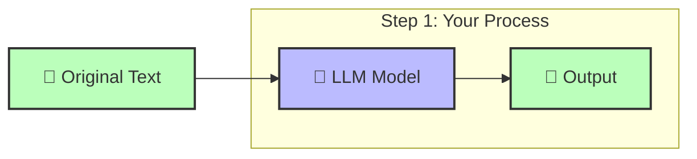

<!-- omit in toc -->
# Contributing to 🌐💬 Aphra

First off, thanks for taking the time to contribute! Your help is greatly appreciated.

All types of contributions are encouraged and valued, whether it's code, documentation, suggestions for new features, or bug reports. Please read through the following guidelines before contributing to ensure a smooth process for everyone involved.

> And if you like the project, but just don't have time to contribute, that's fine. There are other easy ways to support the project and show your appreciation, which we would also be very happy about:
> - Star the project
> - Tweet about it
> - Refer this project in your project's README
> - Mention the project at local meetups and tell your friends/colleagues

<!-- omit in toc -->
## Table of Contents

- [I Have a Question](#i-have-a-question)
- [I Want To Contribute](#i-want-to-contribute)
  - [Reporting Bugs](#reporting-bugs)
  - [Suggesting Enhancements](#suggesting-enhancements)
  - [Your First Code Contribution](#your-first-code-contribution)
  - [Improving The Documentation](#improving-the-documentation)
- [Styleguides](#styleguides)
  - [Commit Messages](#commit-messages)

## I Have a Question

If you want to ask a question, we assume that you have read the available [Documentation](https://github.com/DavidLMS/aphra/blob/main/README.md).

Before you ask a question, it is best to search for existing [Issues](https://github.com/DavidLMS/aphra/issues) that might help you. If you find a relevant issue but still need clarification, feel free to comment on it. Additionally, it’s a good idea to search the web for answers before asking.

If you still need to ask a question, we recommend the following:

- Open an [Issue](https://github.com/DavidLMS/aphra/issues/new).
- Provide as much context as you can about what you're running into.
- Provide project and platform versions (Python, OS, etc.), depending on what seems relevant.

We (or someone in the community) will then take care of the issue as soon as possible.

## I Want To Contribute

> ### Legal Notice <!-- omit in toc -->
> When contributing to this project, you must agree that you have authored 100% of the content, that you have the necessary rights to the content, and that the content you contribute may be provided under the project license.

### Reporting Bugs

#### Before Submitting a Bug Report

A good bug report shouldn't leave others needing to chase you up for more information. Please investigate carefully, collect information, and describe the issue in detail in your report. Follow these steps to help us fix any potential bugs as quickly as possible:

- Ensure you are using the latest version.
- Verify that your issue is not due to misconfiguration or environmental issues. Make sure you have read the [documentation](https://github.com/DavidLMS/aphra/blob/main/README.md).
- Check if the issue has already been reported by searching the [bug tracker](https://github.com/DavidLMS/aphra/issues?q=label%3Abug).
- Gather as much information as possible about the bug:
  - Stack trace (if applicable)
  - OS, platform, and version (Windows, Linux, macOS, etc.)
  - Python version and any relevant package versions
  - Steps to reliably reproduce the issue

#### How Do I Submit a Good Bug Report?

> Do not report security-related issues, vulnerabilities, or bugs with sensitive information in public forums. Instead, report these issues privately by emailing hola_at_davidlms.com.

We use GitHub issues to track bugs and errors. If you run into an issue with the project:

- Open an [Issue](https://github.com/DavidLMS/aphra/issues/new). (Since we can't be sure yet if it’s a bug, avoid labeling it as such until confirmed.)
- Explain the behavior you expected and what actually happened.
- Provide as much context as possible and describe the steps someone else can follow to recreate the issue. This usually includes a code snippet or an example project.

Once it's filed:

- The project team will label the issue accordingly.
- A team member will try to reproduce the issue. If the issue cannot be reproduced, the team will ask for more information and label the issue as `needs-repro`.
- If the issue is reproducible, it will be labeled `needs-fix` and potentially other relevant tags.

### Suggesting Enhancements

This section guides you through submitting an enhancement suggestion for 🌐💬 Aphra, whether it's a new feature or an improvement to existing functionality.

#### Before Submitting an Enhancement

- Ensure you are using the latest version.
- Check the [documentation](https://github.com/DavidLMS/aphra/blob/main/README.md) to see if your suggestion is already supported.
- Search the [issue tracker](https://github.com/DavidLMS/aphra/issues) to see if the enhancement has already been suggested. If so, add a comment to the existing issue instead of opening a new one.
- Make sure your suggestion aligns with the scope and aims of the project. It's important to suggest features that will be beneficial to the majority of users.

#### How Do I Submit a Good Enhancement Suggestion?

Enhancement suggestions are tracked as [GitHub issues](https://github.com/DavidLMS/aphra/issues).

- Use a **clear and descriptive title** for the suggestion.
- Provide a **detailed description** of the enhancement, including any relevant context.
- **Describe the current behavior** and **explain what you would expect instead**, along with reasons why the enhancement would be beneficial.
- Include **screenshots or diagrams** if applicable to help illustrate the suggestion.
- Explain why this enhancement would be useful to most `🌐💬 Aphra` users.

### Your First Code Contribution

#### Pre-requisites

You should first [fork](https://docs.github.com/en/pull-requests/collaborating-with-pull-requests/working-with-forks/fork-a-repo) the `🌐💬 Aphra` repository and then clone your forked repository:

```bash
git clone https://github.com/<YOUR_GITHUB_USER>/aphra.git
````

Once in the cloned repository directory, create a new branch for your contribution:

```bash
git checkout -B <feature-description>
````

### Understanding the Architecture

🌐💬 Aphra uses a modern workflow architecture with auto-discovery and self-contained workflows:

- **Core System** (`aphra/core/`): Base classes, context management, configuration system, and auto-discovery registry
- **Self-Contained Workflows** (`aphra/workflows/`): Complete workflow packages with their own prompts, configuration, parsers, examples, and tests
- **Auto-Discovery**: Workflows are automatically detected and registered - no manual registration needed
- **Workflow-Specific Configuration**: Each workflow has its own `config/default.toml` with LLM models and parameters

#### Current Workflow Structure:
```
aphra/workflows/short_article/
├── config/
│   └── default.toml          # Workflow-specific configuration
├── docs/                     # Optional workflow documentation
│   ├── README.md             # Complete workflow documentation
│   ├── workflow-diagram.md   # Mermaid diagram source
│   └── workflow-diagram.png  # Generated diagram image
├── examples/
│   ├── gradio_demo.py        # Interactive web demo
│   └── simple_demo.py        # Basic usage example
├── prompts/
│   ├── step1_system.txt      # Prompt templates
│   └── ...
├── aux/
│   └── parsers.py            # Workflow-specific utilities
├── tests/
│   ├── test_parsers.py       # Workflow tests
│   └── test_prompts.py
└── short_article_workflow.py # Main workflow implementation
```

### Contributing Workflow

1. **Understand the Component You're Modifying:**
   - **Core System** (`aphra/core/`): Changes here affect the entire system. Use caution and ensure backwards compatibility.
   - **Existing Workflows**: Modify within the workflow's own directory structure. All changes stay self-contained.
   - **New Workflows**: Follow the auto-discovery structure - no manual registration required.

2. **Development Guidelines:**
   - Make sure your code follows the style guide and passes linting with `pylint`.
   - Write tests for any new functionality you add.
   - For new workflows, inherit from `AbstractWorkflow` and implement required methods.
   - Use the workflow-specific configuration system (`config/default.toml`).
   - Ensure all tests pass before submitting a pull request.
   - Document any changes to APIs or core functionality.

3. **Workflow Development:**
   - **Configuration**: Define your LLM models and parameters in `config/default.toml`
   - **API Access**: Use `context.get_workflow_config('writer')` to access model names
   - **Auto-Discovery**: Simply create the directory structure - no manual registration
   - **Self-Contained**: Keep all workflow-related code within the workflow directory

4. **Testing Guidelines:**
   - **Real API Calls**: Tests use real OpenRouter API calls with actual models
   - **Configuration**: Tests use `config.toml` with real API keys
   - **Structure**: Core tests in `tests/`, workflow tests in `workflows/[name]/tests/`
   - **Coverage**: Test individual methods AND complete workflow execution
   - **Run Tests**: `python -m pytest tests/ -v` (requires valid API key)

5. **Submission Process:**
   - Submit your pull request with a clear and descriptive title and description.
   - Explain how your changes fit into the self-contained workflow architecture.
   - Include examples of how to use any new components you've created.
   - Ensure your workflow is fully self-contained and follows the standard structure.

## Creating New Workflows

Adding a new workflow to 🌐💬 Aphra is straightforward thanks to the auto-discovery system. Simply create the directory structure and your workflow will be automatically detected.

### Step-by-Step Guide

#### 1. Create the Workflow Directory Structure

```bash
mkdir -p aphra/workflows/my_workflow/{config,examples,prompts,aux,tests}
```

#### 2. Implement the Workflow Class

Create `aphra/workflows/my_workflow/my_workflow.py`:

```python
from typing import Dict, Any
from ...core.context import TranslationContext
from ...core.workflow import AbstractWorkflow

class MyWorkflow(AbstractWorkflow):
    def get_workflow_name(self) -> str:
        return "my_workflow"
    
    def is_suitable_for(self, text: str, **kwargs) -> bool:
        # Define when this workflow should be used
        return "specific_condition" in text.lower()
    
    def execute(self, context: TranslationContext, text: str) -> str:
        # Access workflow configuration
        writer_model = context.get_workflow_config('writer')
        
        # Implement your translation logic
        # Call LLM: context.model_client.call_model(system, user, writer_model)
        
        return translated_text
```

#### 3. Create Configuration File

Create `aphra/workflows/my_workflow/config/default.toml`:

```toml
# Default configuration for My Workflow
writer = "anthropic/claude-sonnet-4"
searcher = "perplexity/sonar"
critiquer = "anthropic/claude-sonnet-4"

# Workflow-specific parameters
custom_param = "default_value"
max_retries = 3
```

#### 4. Add Prompt Templates

Create prompt files in `aphra/workflows/my_workflow/prompts/`:

```
prompts/
├── system_prompt.txt
└── user_prompt.txt
```

#### 5. Create Examples

Create usage examples in `aphra/workflows/my_workflow/examples/`:

```python
# simple_demo.py
from ..my_workflow import MyWorkflow
from ....core.context import TranslationContext
from ....core.llm_client import LLMModelClient

def main():
    workflow = MyWorkflow()
    model_client = LLMModelClient('config.toml')
    context = TranslationContext(
        model_client=model_client,
        source_language="Spanish",
        target_language="English",
        log_calls=False
    )
    
    result = workflow.run(context, "Your text here")
    print(result)
```

#### 6. Write Tests

Create tests in `aphra/workflows/my_workflow/tests/`:

```python
# test_my_workflow.py
import unittest
from ..my_workflow import MyWorkflow

class TestMyWorkflow(unittest.TestCase):
    def test_workflow_execution(self):
        workflow = MyWorkflow()
        # Test with real API calls
        # ...
```

#### 7. User Configuration Override

Users can override your default configuration in their `config.toml`:

```toml
[openrouter]
api_key = "user_api_key"

[my_workflow]
writer = "different/model"
custom_param = "user_value"
```

### Best Practices

- **Self-Contained**: Keep everything related to your workflow in its directory
- **Clear Naming**: Use descriptive names for methods and configuration parameters  
- **Error Handling**: Handle API failures and malformed responses gracefully
- **Documentation**: Add docstrings explaining what your workflow does and when to use it
- **Real Tests**: Write tests that make actual API calls to validate functionality
- **Examples**: Provide both simple and advanced usage examples
- **Diagrams**: Consider adding workflow diagrams to visualize the process (optional but recommended)

### Auto-Discovery

Once you create the directory structure and implement the class, your workflow is automatically:

- **Discovered** by the system at runtime
- **Available** through the standard `translate()` function
- **Configurable** through the user's `config.toml`

No manual registration or configuration is needed!

### Adding Workflow Documentation (Optional)

To provide comprehensive documentation for your workflow, consider adding a `docs/` directory:

#### Documentation Structure

```bash
mkdir -p aphra/workflows/my_workflow/docs
```

Create the following files:

1. **`docs/README.md`** - Complete workflow documentation:
   ```markdown
   # My Workflow
   
   ## Overview
   Brief description of what this workflow does.
   
   ## When to Use
   Explain when this workflow should be used.
   
   ## Configuration
   Document configuration options and defaults.
   
   ## Usage Examples
   Show basic and advanced usage.
   ```

2. **`docs/workflow-diagram.md`** (Optional) - Mermaid flowchart:
   ```markdown
   ```mermaid
   flowchart LR
       A[Input] --> B[Step 1]
       B --> C[Step 2]
       C --> D[Output]
   ```
   ```

3. **`docs/workflow-diagram.png`** (Optional) - Generated diagram image

#### Creating Workflow Diagrams

Workflow diagrams help users understand the process visually. Use [Mermaid](https://mermaid.js.org/) syntax:

**Basic Template:**


**Tools for PNG Generation:**
- [Mermaid Live Editor](https://mermaid.live/)
- [mermaid-cli](https://github.com/mermaid-js/mermaid-cli)
- GitHub renders Mermaid automatically in markdown

#### Documentation Best Practices

- **Clear Overview**: Explain what problem your workflow solves
- **Usage Guidelines**: When to use vs. when not to use this workflow  
- **Configuration Options**: Document all configurable parameters
- **Examples**: Provide both simple and complex usage examples
- **Performance Notes**: Mention typical execution times and API usage
- **Limitations**: Be honest about what your workflow cannot do

### Improving The Documentation

Contributions to documentation are welcome! Well-documented code is easier to understand and maintain. If you see areas where documentation can be improved, feel free to submit your suggestions.

## Styleguides

### Commit Messages

- Use clear and descriptive commit messages.
- Follow the general format: `Short summary (50 characters or less)` followed by an optional detailed explanation.

### Code Style

- Ensure your code adheres to the project's coding standards and passes all linting checks with `pylint`.

## License

By contributing to 🌐💬 Aphra, you agree that your contributions will be licensed under the MIT License.
