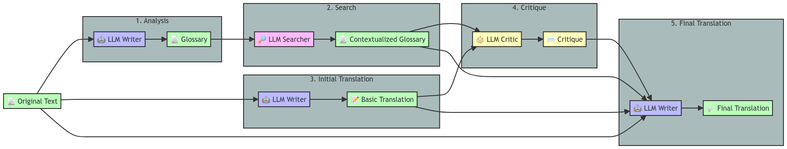

# 🌐💬 Aphra

<p align="center">
  <a href="https://github.com/DavidLMS/aphra/pulls">
    
  </a>
  <a href="LICENSE">
      
    </a>
    <a href="https://github.com/pylint-dev/pylint">
      
    </a>
  <a href="https://deepwiki.com/DavidLMS/aphra">
      
    </a>
</p>

🌐💬 Aphra is an open-source translation agent designed to enhance the quality of text translations by leveraging large language models (LLMs). Unlike traditional translation tools that rely solely on direct translations, Aphra introduces a multi-stage, context-aware process that includes glossary creation, contextual search, critique, and refinement. This approach aims to produce translations that not only retain the original meaning but also incorporate translator notes, contextual adjustments, and stylistic improvements. Whether you're translating blog posts, articles, or complex documents, Aphra ensures a more nuanced and accurate translation that respects the original content's integrity.

> **Important Note:** 🌐💬 Aphra is not intended to replace the work of a professional translator. Instead, it aims to facilitate multilingual support in small projects where hiring a professional translator may not be feasible. Aphra offers a practical solution for achieving quality translations in contexts where a fully professional translation service is out of scope, ensuring that language barriers do not hinder the global reach of your content.

<p align="center">
    <a href="https://huggingface.co/spaces/davidlms/aphra">Demo</a>
    ·
    <a href="https://github.com/DavidLMS/aphra/issues/new?assignees=&labels=bug&projects=&template=bug_report.md&title=%5BBUG%5D">Report Bug</a>
    ·
    <a href="https://github.com/DavidLMS/aphra/issues/new?assignees=&labels=enhancement&projects=&template=feature_request.md&title=%5BREQUEST%5D">Request Feature</a>
    ·
    <a href="https://github.com/DavidLMS/aphra/wiki">Wiki</a>
  </p>

## Table of Contents

[Motivation](#motivation)

[Why Aphra?](#why-aphra)

[How 🌐💬 Aphra Works](#how--aphra-works)

[Demo](#demo)

[Getting Started](#getting-started)

[Customizability and Ideas for Extensions](#customizability-and-ideas-for-extensions)

[License](#license)

[Contributing](#contributing)

[References](#references)

## Motivation

The spark for starting this project came from a desire to challenge myself by designing a complex agentic workflow from scratch. The primary goal here is to learn and grow through the process of building something like this from the ground up. I chose the theme of translation because I've been toying with the idea of publishing [my personal blog](https://davidlms.com) in English as well. I have successfully integrated 🌐💬 Aphra into the publication pipeline, making translations a seamless part of the process. If you're interested in how this was achieved, you can find a detailed guide in the [Wiki](https://github.com/DavidLMS/aphra/wiki/Using-in-a-pipeline).

As a computer science teacher, I also saw this as a great opportunity to create a small, yet complete, open-source project that follows best practices for publishing on GitHub. That's why there are so many options to get started, all designed with a didactic approach in mind. Any feedback on how to improve in that area is more than welcome.

## Why Aphra?

The name "Aphra" is a tribute to [Aphra Behn](https://en.wikipedia.org/wiki/Aphra_Behn), one of the first English women to earn a living through writing in the 17th century. Behn was a playwright, poet, and translator who broke through significant cultural barriers, making her an early pioneer for women in literature.

Naming this project after Aphra Behn is a way to honor her legacy of challenging the status quo and shaping the way we think about language and expression. Her influence reminds us of the importance of creating spaces where voices can be heard and ideas can flourish.

As [Virginia Woolf](https://en.wikipedia.org/wiki/Virginia_Woolf) famously said, "All women together, ought to let flowers fall upon the grave of Aphra Behn... for it was she who earned them the right to speak their minds" (Woolf, Virginia. A Room of One's Own. 1928, at 65).

## How 🌐💬 Aphra Works

🌐💬 Aphra employs a multi-stage, agentic approach to translation using a **workflow architecture** designed to closely mimic the steps a human translator might take when working on a text. The system is built around workflows that orchestrate translation through specialized methods.

### Architecture

Aphra's architecture consists of several key components:

- **Workflows**: Self-contained classes that implement complete translation processes using simple methods.
- **Context**: Shared state management across the entire translation process.
- **Registry**: Central discovery and management system for available workflows.
- **Core Components**: LLM client, parsers, and utilities that workflows use internally.

### Short Article Workflow (Default)



The default workflow implements the proven 5-step translation process using simple methods:

1. **analyze()**: The "LLM Writer" analyzes the original text, identifying key expressions, terms, and entities that may pose challenges in translation, such as culturally specific references or industry jargon.

2. **search()**: Any LLM model, enhanced with OpenRouter's web search capabilities, takes the identified terms and searches for real-time, up-to-date context. This includes current definitions, background information, or examples of usage in different contexts, ensuring that the translation is well-informed and accurate.

3. **translate()**: The "LLM Writer" produces an initial translation that preserves the original style and structure of the text, focusing on linguistic accuracy while preparing for contextual refinement.

4. **critique()**: The "LLM Critic" reviews the initial translation in light of the gathered context and original text, providing feedback on areas where the translation could be improved. The critique highlights potential misinterpretations, suggests alternative phrasings, or recommends adding translator notes for clarity.

5. **refine()**: Finally, the "LLM Writer" creates the final translation, incorporating the critic's feedback and the contextual information gathered earlier. The result is a polished, contextually aware translation that is more nuanced and accurate than a simple literal translation.

### Web Search Integration

Aphra leverages OpenRouter's advanced web search capabilities:
- **Universal Web Access**: Any model can now access real-time web information via OpenRouter's web plugin.
- **High-Context Search**: Uses "high" search context for maximum information retrieval.
- **Automatic Citations**: Web search results include proper source citations.
- **Cost-Effective**: Powered by Exa search with transparent pricing ($4 per 1000 results).

### Extensible Design

The workflow architecture enables:
- **Custom Workflows**: Create specialized translation workflows by inheriting from base classes and overriding methods.
- **Method Reusability**: Individual methods can be reused by inheritance or composition.
- **Easy Testing**: Each method can be tested independently.
- **Future Expansion**: New workflows can be added without modifying existing code.

This structured approach enables 🌐💬 Aphra to produce translations that are not only linguistically accurate but also contextually rich, while providing a solid foundation for extending the system to handle various types of content and use cases.

## Demo

You can test 🌐💬 Aphra here: [https://huggingface.co/spaces/davidlms/aphra](https://huggingface.co/spaces/davidlms/aphra).

## Getting Started

To get started with 🌐💬 Aphra, follow these steps:

### Prerequisites

Ensure you have the following installed on your system:
- `git` (for cloning the repository)
- Python 3.8 or higher
- `pip` (Python package installer)
- Docker (optional, for using Docker)

### Clone the Repository

Before proceeding with the configuration or installation, you need to clone the repository. This is a common step required for all installation methods.

1. Clone the repository:
    ```bash
    git clone https://github.com/DavidLMS/aphra.git
    ```

2. Navigate into the project directory:
    ```bash
    cd aphra
    ```

### Configuration

1. Copy the example configuration file:
    ```bash
    cp config.example.toml config.toml
    ```

2. Edit `config.toml` to add your [OpenRouter](https://openrouter.ai) API key and desired model names.

After configuring the `config.toml` file, you can either:

- **Use 🌐💬 Aphra directly in the current directory** of the repository (as explained in the [Usage section](#usage)), or
- **Proceed with the installation** in the next section to make 🌐💬 Aphra accessible from any script on your system.

> **Note:** If you choose to proceed with the installation, remember to move the `config.toml` file to the location of the script using 🌐💬 Aphra, or specify its path directly when calling the function.

### Installation

#### Option 1: Install Locally with `pip`

This option is the simplest way to install 🌐💬 Aphra if you don't need to isolate its dependencies from other projects. It directly installs the package on your system using `pip`, which is the standard package manager for Python.

1. Install the package locally:
    ```bash
    pip install .
    ```

#### Option 2: Install with Poetry

Poetry is a dependency management and packaging tool for Python that helps you manage your project's dependencies more effectively. It also simplifies the process of packaging your Python projects.

1. Install Poetry if you haven't already:
    ```bash
    curl -sSL https://install.python-poetry.org | python3 -
    ```

2. Install dependencies and the package:
    ```bash
    poetry install
    ```

3. Activate the virtual environment created by Poetry:
    ```bash
    poetry shell
    ```

#### Option 3: Use a Virtual Environment

A virtual environment is an isolated environment that allows you to install packages separately from your system's Python installation. This is particularly useful to avoid conflicts between packages required by different projects.

1. Create and activate a virtual environment:
    ```bash
    python -m venv aphra
    source aphra/bin/activate  # On Windows: aphra\Scripts\activate
    ```
    
2. Remove the file pyproject.toml:
    ```bash
    rm pyproject.toml
    ```
    
3. Install the package locally:
    ```bash
    pip install .
    ```

#### Option 4: Use Docker

Docker is a platform that allows you to package an application and its dependencies into a "container." This container can run consistently across different environments, making it ideal for ensuring that your project works the same way on any machine.

1. Build the Docker image:
    ```bash
    docker build -t aphra .
    ```
    > **Note:** If you encounter permission errors during the build, try running the command with `sudo`.

2. Ensure the entry script has execution permissions. Run the following command:
    ```bash
    chmod +x entrypoint.sh
    ```
    > **For Windows users:** You can add execute permissions using Git Bash or WSL (Windows Subsystem for Linux). If you’re using PowerShell or Command Prompt, you might not need to change permissions, but ensure the script is executable in your environment.

3. Understand the `docker run` command:
    - `-v $(pwd):/workspace`: This option mounts your current directory (`$(pwd)` in Unix-like systems, `%cd%` in Windows) to the `/workspace` directory inside the container. This allows the container to access files in your current directory.
    - `aphra`: This is the name of the Docker image you built in step 1.
    - `English Spanish`: These are the source and target languages for translation. Replace them with the languages you need.
    - `input.md`: This is the path to the input file on your host machine.
    - `output.md`: This is the path where the translated output will be saved on your host machine.
    - *(optional)* A workflow name (e.g., `short_article`) to explicitly select a workflow. If omitted, Aphra auto-selects based on content.

4. Run the Docker container:
    ```bash
    docker run -v $(pwd):/workspace aphra English Spanish input.md output.md
    ```

    To explicitly choose a workflow:
    ```bash
    docker run -v $(pwd):/workspace aphra English Spanish input.md output.md short_article
    ```

5. Display the translation by printing the content of the output file:
    - On Unix-like systems (Linux, macOS, WSL):
    ```bash
    cat output.md
    ```
    - On Windows (PowerShell):
    ```bash
    Get-Content output.md
    ```
    - On Windows (Command Prompt):
    ```cmd
    type output.md
    ```

### Usage

#### Using Aphra from the Command Line

You can run Aphra directly from the terminal using the `aphra_runner.py` script. This is particularly useful for automating translations as part of a larger workflow or pipeline.

The CLI supports two styles: flag-based and positional (legacy).

**Flag-based (recommended):**

```bash
python aphra_runner.py -c <config_file> -s <source_language> -t <target_language> -i <input_file> -o <output_file> [-w <workflow>]
```

**Positional (legacy, backwards-compatible):**

```bash
python aphra_runner.py <config_file> <source_language> <target_language> <input_file> <output_file> [workflow]
```

**Parameters:**

- `-c`, `--config`: Path to the configuration file containing API keys and model settings (e.g., `config.toml`).
- `-s`, `--source`: The language of the input text (e.g., "Spanish").
- `-t`, `--target`: The language you want to translate the text into (e.g., "English").
- `-i`, `--input`: Path to the input file containing the text you want to translate.
- `-o`, `--output`: Path where the translated text will be saved.
- `-w`, `--workflow` *(optional)*: Name of the workflow to use (e.g., `short_article`). If omitted, Aphra auto-selects based on content.

**Examples:**

```bash
# Flag-based
python aphra_runner.py -c config.toml -s Spanish -t English -i input.md -o output.md

# With workflow
python aphra_runner.py -c config.toml -s Spanish -t English -i input.md -o output.md -w short_article

# Positional (legacy)
python aphra_runner.py config.toml Spanish English input.md output.md

# Positional with workflow
python aphra_runner.py config.toml Spanish English input.md output.md short_article
```

#### Using Aphra as a Python Function

If you prefer to use Aphra directly in your Python code, the `translate` function allows you to translate text from one language to another using the configured language models. The function takes the following parameters:

- `source_language`: The language of the input text (e.g., "Spanish").
- `target_language`: The language you want to translate the text into (e.g., "English").
- `text`: The text you want to translate.
- `config_file`: The path to the configuration file containing API keys and model settings. Defaults to "config.toml".
- `log_calls`: A boolean indicating whether to log API calls for debugging purposes. Defaults to `False`.
- `workflow`: Name of the workflow to use (e.g., `"short_article"`). If `None`, auto-selects based on content. Defaults to `None`.

Here is how you can use the `translate` function in a generic way:

```python
from aphra import translate

translation = translate(source_language='source_language',
                        target_language='target_language',
                        text='text_to_translate',
                        config_file='config.toml',
                        log_calls=False)
print(translation)
```

To explicitly choose a workflow:

```python
from aphra import translate

translation = translate(source_language='Spanish',
                        target_language='English',
                        text='text_to_translate',
                        config_file='config.toml',
                        workflow='short_article')
print(translation)
```

##### Example 1: Translating a Simple Sentence

Suppose you want to translate the sentence "Hola mundo" from Spanish to English. The code would look like this:

```python
from aphra import translate

translation = translate(source_language='Spanish',
                        target_language='English',
                        text='Hola mundo',
                        config_file='config.toml',
                        log_calls=False)
print(translation)
```

##### Example 2: Translating Content from a Markdown File

If you have a Markdown file (`input.md`) containing the text you want to translate, you can read the file, translate its content, and then print the result or save it to another file. Here's how:

```python
from aphra import translate

# Read the content from the Markdown file
with open('input.md', 'r', encoding='utf-8') as file:
    text_to_translate = file.read()

# Translate the content from Spanish to English
translation = translate(source_language='Spanish',
                        target_language='English',
                        text=text_to_translate,
                        config_file='config.toml',
                        log_calls=False)

# Print the translation or save it to a file
print(translation)

with open('output.md', 'w', encoding='utf-8') as output_file:
    output_file.write(translation)
```

In this example:

- We first read the text from `input.md`.
- Then, we translate the text from Spanish to English.
- Finally, we print the translation to the console and save it to `output.md`.

## Customizability and Ideas for Extensions

🌐💬 Aphra's workflow architecture is designed with extensibility and customization at its core. The system provides multiple levels of customization, from simple prompt modifications to creating entirely new workflows.

### Customization Levels

#### 1. Configuration Customization (Simplest)
Override workflow configuration in your `config.toml` to use different models:

```toml
[openrouter]
api_key = "your_api_key"

[short_article]
writer = "anthropic/claude-sonnet-4"
searcher = "perplexity/sonar"
critiquer = "different/model"
```

#### 2. Prompt Customization (Simple)
Modify the prompts within a workflow's `prompts/` folder to adapt the output for your specific use cases:
- `aphra/workflows/short_article/prompts/step1_system.txt` - Analysis step prompts
- `aphra/workflows/short_article/prompts/step2_system.txt` - Search step prompts  
- `aphra/workflows/short_article/prompts/step3_system.txt` - Translation step prompts
- `aphra/workflows/short_article/prompts/step4_system.txt` - Critique step prompts
- `aphra/workflows/short_article/prompts/step5_system.txt` - Refinement step prompts

#### 3. Method Customization (Intermediate)
Customize translation behavior by inheriting from `ShortArticleWorkflow` and overriding specific methods:

```python
from aphra.workflows.short_article.short_article_workflow import ShortArticleWorkflow
from aphra.core.context import TranslationContext

class CustomWorkflow(ShortArticleWorkflow):
    def analyze(self, context: TranslationContext, text: str):
        # Your custom analysis logic here
        return super().analyze(context, text)
    
    def search(self, context: TranslationContext, parsed_items):
        # Your custom search logic here
        return super().search(context, parsed_items)
```

#### 4. Complete Workflow Creation (Advanced)
Build entirely new workflows by creating a self-contained workflow directory with auto-discovery:

```bash
mkdir -p aphra/workflows/my_workflow/{config,examples,prompts,aux,tests}
```

Then implement your workflow class:

```python
# aphra/workflows/my_workflow/my_workflow.py
from aphra.core.workflow import AbstractWorkflow
from aphra.core.context import TranslationContext

class MyWorkflow(AbstractWorkflow):
    def get_workflow_name(self) -> str:
        return "my_workflow"
    
    def is_suitable_for(self, text: str, **kwargs) -> bool:
        # Define suitability criteria
        return "specific_condition" in text.lower()
    
    def run(self, context: TranslationContext, text: str) -> str:
        # Access workflow configuration
        writer_model = context.get_workflow_config('writer')
        
        # Your complete workflow logic here
        return translated_text
```

Create configuration file `aphra/workflows/my_workflow/config/default.toml`:

```toml
writer = "anthropic/claude-sonnet-4"
searcher = "perplexity/sonar"
custom_param = "default_value"
```

No manual registration needed - auto-discovery handles everything!

### Extension Ideas

The workflow architecture opens up exciting possibilities:

- **Specialized Content Workflows:**
  - **Academic Papers**: Enhanced terminology handling and citation preservation.
  - **Technical Documentation**: API reference translation with code preservation.
  - **Marketing Content**: Tone and brand voice adaptation across languages.
  - **Legal Documents**: Precision-focused translation with legal term verification.

- **Enhanced Search Capabilities:**
  - **Agent-Based Web Search**: Replace LLM searcher with custom web search agents.
  - **Domain-Specific Databases**: Integrate specialized terminology databases.
  - **Visual Context**: Add image analysis for documents with visual elements.

- **Local and Hybrid Operation:**
  - **Ollama Integration**: Run workflows entirely locally using open-source models.
  - **Hybrid Cloud-Local**: Use local models for sensitive content, cloud for complex analysis.
  - **Custom Model Integration**: Plug in specialized translation models.

- **Quality Assurance Extensions:**
  - **Multiple Critic Workflow**: Use several specialized critics for different aspects.
  - **Human-in-the-Loop**: Add human review steps at critical points.
  - **Quality Metrics**: Automatic translation quality assessment.

- **Performance Optimizations:**
  - **Parallel Step Execution**: Run independent steps concurrently.
  - **Caching System**: Cache analysis and search results for similar content.
  - **Streaming Translation**: Process large documents in chunks.

### Getting Started with Extensions

1. **Fork the Repository**: Start with your own copy of Aphra.
2. **Study the Existing Code**: Examine `aphra/workflows/short_article/` for examples of workflow implementation.
3. **Create Your Components**: Build your custom steps and workflows.
4. **Test Thoroughly**: Use the existing test framework as a guide.
5. **Share Your Work**: Consider contributing your extensions back to the community.

The workflow design ensures that your extensions are isolated, testable, and maintainable, while the registry system makes them discoverable and reusable.

Feel free to experiment and extend 🌐💬 Aphra in ways that suit your projects and ideas. The architecture is built to grow with your needs!

## License

🌐💬 Aphra is released under the [MIT License](https://github.com/DavidLMS/aphra/blob/main/LICENSE). You are free to use, modify, and distribute the code for both commercial and non-commercial purposes.

## Contributing

Contributions to 🌐💬 Aphra are welcome! Whether it's improving the code, enhancing the documentation, or suggesting new features, your input is valuable. Please check out the [CONTRIBUTING.md](https://github.com/DavidLMS/aphra/blob/main/CONTRIBUTING.md) file for guidelines on how to get started and make your contributions count.

## References

- *Assisting in Writing Wikipedia-like Articles From Scratch with Large Language Models*, Shao et al. (2024), [https://arxiv.org/abs/2402.14207](https://arxiv.org/abs/2402.14207)
- *Translation Agent*, Ng (2024), [https://github.com/andrewyng/translation-agent](https://github.com/andrewyng/translation-agent)
